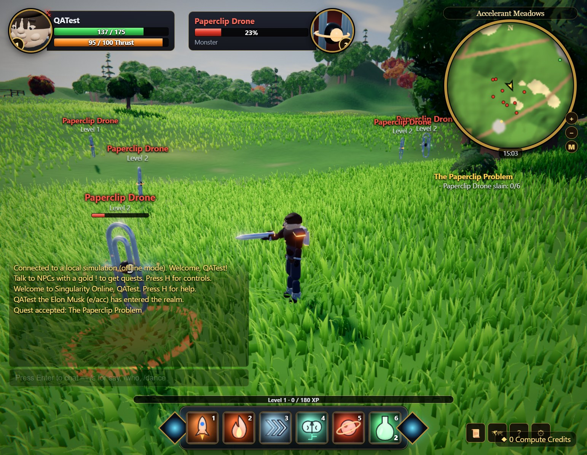

# Singularity Online — Accelerate or Align

A browser MMORPG parody in the classic MMO style. You pick a banner, **e/acc** (The Accelerationists) or **EA** (The Aligned), then play one of 8 champions based on public tech figures. Quest, level to 10, fight in PvP, and team up across factions to defeat **Moloch** at the Singularity Spire.

**Play it in your browser: https://peterxing.github.io/singularity-online/**. The hosted build joins the shared online realm at `singularity-online.onrender.com`. That free server sleeps when idle, so the first visitor may wait about a minute, or can jump straight into a solo realm with simulated players. You can also play directly on the server at https://singularity-online.onrender.com/.

Everything is generated in code, with no image, model or audio assets. That covers terrain, grass, trees, water, sky, buildings, characters, monsters, VFX, UI icons and music/SFX. The only library is three.js (MIT, vendored in `client/vendor/three`).

> Parody: the characters are satirical caricatures of public personas. They aren't affiliated with or endorsed by any person or company.



## Run it locally (multiplayer)

```
npm install
npm start          # or double-click start.cmd
```

Open http://localhost:8080. Friends on your network can join at `http://<your-ip>:8080`. Progress is saved per name and champion in `data/characters.json`.

- **Hosted build (GitHub Pages):** the `client/` folder deploys automatically to GitHub Pages on every push to `main`. With no server, the world simulation runs in the browser with simulated players, and progress is saved in `localStorage`. The same happens with `?offline`.
- **Online multiplayer from the hosted build:** the Pages build connects to `DEFAULT_REALM` in `client/js/net.js`, a free Render web service defined in `render.yaml`. To use your own server, run `server/server.js` on any Node host that supports WebSockets and open the Pages URL with `?realm=wss://your-host/ws`. Add `?solo` to force the in-browser realm. The free Render instance doesn't auto-deploy; use **Manual Deploy** in the Render dashboard after server changes. Saves on the free instance reset when it restarts.
- `PORT=9000 npm start` changes the port. `BOTS=0 npm start` disables the simulated players.

## Controls

| Input | Action |
|---|---|
| W/S, A/D, Q/E | Run, turn (strafe with right mouse), strafe |
| Space | Jump |
| Left / right mouse drag | Look around / steer |
| Wheel | Zoom |
| Click / right-click | Target / attack, talk, gather |
| Tab | Cycle enemies |
| 1–5, 6 | Abilities, Energy Drink |
| F | Interact |
| Enter | Chat (`/s`, `/who`, `/dance`, `/wave`, `/sit`, `/cheer`, `/stuck`) |
| L / M / H / Esc | Quest log / map / help / settings |

## Champions

| e/acc | Role | EA | Role |
|---|---|---|---|
| Elon Musk: The Technoking | Ranged DPS | Dario Amodei: The Constitutionalist | Tank / Healer |
| Beff Jezos: Prophet of the Thermodynamic God | Melee DPS | Eliezer Yudkowsky: The Doom Prophet | Ranged DPS |
| Sam Altman: The Scaler | Support | Will MacAskill: The Longtermist | Healer |
| Marc Andreessen: The Techno-Optimist | Tank | Nick Bostrom: The Simulation Theorist | Control Mage |

## Layout

- `server/server.js`: static hosting, WebSocket realm and persistence.
- `client/shared/`: deterministic terrain, game data and the authoritative world simulation (combat, AI, bots, quests). The server and the browser both use it.
- `client/js/`: renderer (sky, terrain, grass, foliage, water, buildings, post-processing), procedural rigged characters and monsters, VFX, UI, audio and networking.

Graphics quality adapts automatically. You can also change it in Settings (Esc). Dev views: `?gallery=champs`, `?gallery=mobs`.

## License

MIT; see [LICENSE](LICENSE). The bundled three.js keeps its own MIT license.
